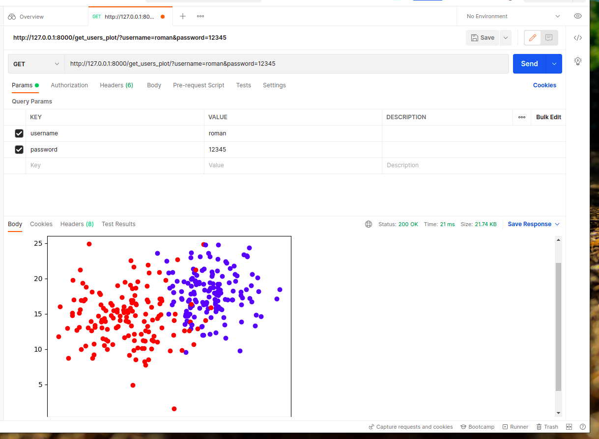
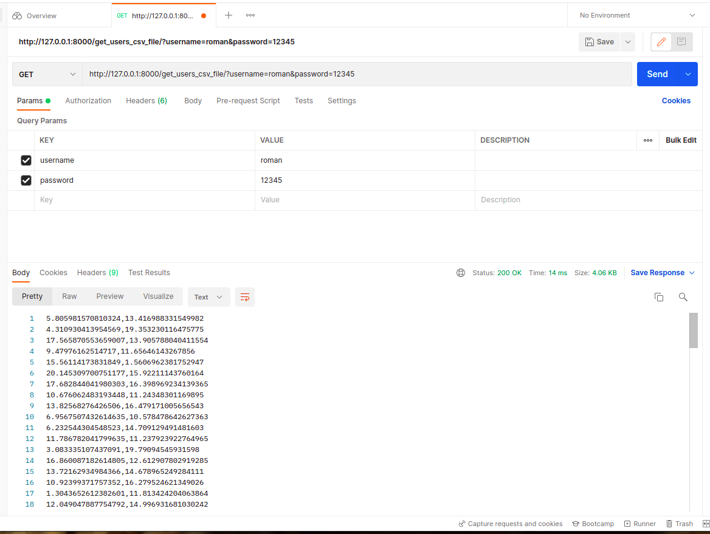

# Sreda_rest_api
This project generate random points with given Mean of distribution and Standard derivation at X1 and X2 characteristics when user is register.
There are possibility to get user's points in csv file, get user's plot and re-generate new random points.

## Technologies
Project is created with:
* Python version: 3.8
* Django version: 4.0.2
* Docker version: 20.10.12

## Setup
To run this project, install it locally using:
1. git clone https://github.com/Hyper-glitch/Sreda_test.git
2. docker-compose up (when you are in sreda dir) 

# Example screens

